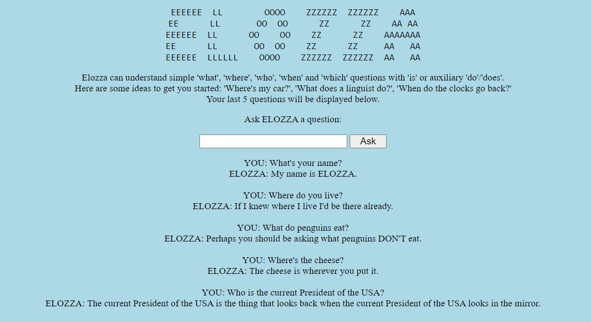

# ELOZZA

[ELOZZA](https://elozza.herokuapp.com/) is a question-answering chatbot inspired by [ELIZA](https://en.wikipedia.org/wiki/ELIZA).

She can understand simple 'what', 'where', 'who', 'when' and 'which' questions with 'is' or auxiliary 'do'/'does'.

[Click here](https://elozza.herokuapp.com/) to have a conversation with ELOZZA.

